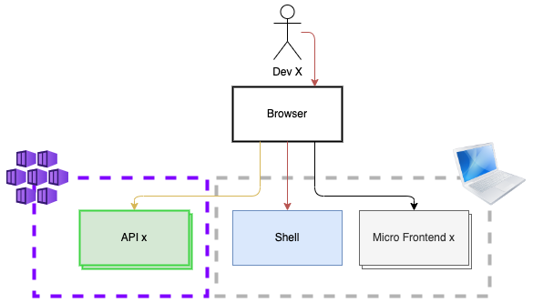

# Hoe deployen we jullie Micro Frontends?

|Startpunt (dit grijze gedeelte hebben jullie gemaakt) |..en hier willen we naar toe! 
|--|--|
||

## Wat ontbreekt:
- [ ] Tot nu toe zijn de MF Docker containers alleen lokaal gedraaid, ze moeten óf ergens publiek komen te staan óf in de Azure Container Registry van het cluster komen.
- [ ] Tot nu toe hadden we een default Shell, we moeten een Shell hebben met alle MF's. Deze moet óf ergens publiek komen te staan óf in de Azure Container Registry van het cluster komen.
- [ ] De pipeline voor het app gedeelte deployed op dit moment een (default) Shell en de API's. We hebben een Shell deployment nodig van de complete Shell.
- [ ] Van de Micro Frontends is de Welkom page gedeployed, maar meer ook niet. We hebben al jullie MF's als deployment nodig in AKS.

## Wat nu?
- [Top](#hoe-deployen-we-jullie-micro-frontends)
- [Terug naar het Overzicht](../README.md)